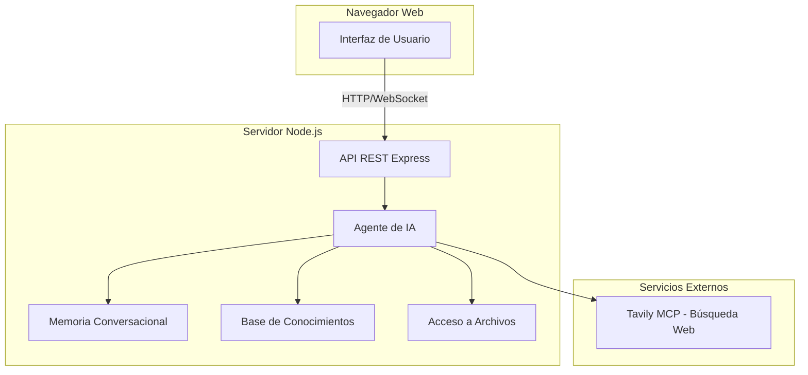

# Plan JARVIS - Agente de Conocimiento con IA

## Visión General del Proyecto

JARVIS será un asistente de inteligencia artificial con interfaz web que combina búsqueda en internet, gestión de conocimiento personalizado, acceso a archivos locales y memoria conversacional para ayudar al usuario a resolver dudas y problemas.

## Arquitectura del Sistema



## Stack Tecnológico

- **Runtime:** Node.js 20+ (última versión LTS)
- **Servidor:** Express.js
- **Frontend:** HTML5 + CSS3 + Vanilla JavaScript
- **Búsqueda Web:** Tavily MCP
- **Almacenamiento:** JSON (memoria) + Markdown (base de conocimientos)
- **Gestión de dependencias:** npm

## Componentes Principales

### 1. Servidor Express (`server.js`)
- Endpoints REST para chat, búsqueda, archivos
- Servir archivos estáticos
- Gestión de sesiones

### 2. Agente de IA (`agent/`)
- Orquestador principal
- Motor de búsqueda web
- Procesador de conocimiento
- Analizador de problemas

### 3. Memoria Conversacional (`memory/`)
- Almacenar historial de conversaciones
- Contexto persistente
- Búsqueda en historial

### 4. Base de Conocimientos (`knowledge/`)
- Documentos markdown
- Notas estructuradas
- Búsqueda semántica

### 5. Acceso a Archivos (`files/`)
- Leer archivos locales
- Indexar contenido
- Buscar en documentos

### 6. Interfaz Web (`public/`)
- Chat interactivo
- Panel de configuración
- Historial de conversaciones

## Estructura de Archivos

```
jarvis/
├── package.json
├── server.js
├── agents/
│   ├── agent.js          # Orquestador principal
│   ├── search.js         # Búsqueda web
│   ├── knowledge.js      # Base de conocimientos
│   ├── files.js          # Acceso a archivos
│   └── problem-solver.js # Resolución de problemas
├── memory/
│   └── memory.js         # Memoria conversacional
├── knowledge/
│   └── docs/             # Documentos de conocimiento
├── public/
│   ├── index.html        # Interfaz principal
│   ├── style.css         # Estilos
│   └── app.js            # Lógica del cliente
├── config/
│   └── config.js         # Configuración
└── .env                  # Variables de entorno
```

## Flujo de Trabajo del Agente

```mermaid
sequence diagram
    Usuario->>Interfaz: Envía pregunta
    Interfaz->>Servidor: POST /api/chat
    Servidor->>Agente: Procesar pregunta
    Agente->>Memoria: Verificar contexto previo
    Memoria-->>Agente: Historial relevante
    alt Búsqueda web necesaria
        Agente->>Tavily: Buscar en internet
        Tavily-->>Agente: Resultados
    end
    alt Conocimiento existente
        Agente->>BaseConocimientos: Consultar documentos
        BaseConocimientos-->>Agente: Información relevante
    end
    alt Acceso a archivos
        Agente->>Archivos: Leer archivos locales
        Archivos-->>Agente: Contenido
    end
    Agente->>Memoria: Guardar conversación
    Agente-->>Servidor: Respuesta
    Servidor-->>Interfaz: Mostrar respuesta
    Interfaz-->>Usuario: Respuesta final
```

## APIs del Servidor

| Método | Endpoint | Descripción |
|--------|----------|-------------|
| POST | /api/chat | Enviar mensaje al agente |
| GET | /api/history | Obtener historial de conversaciones |
| POST | /api/search | Búsqueda web directa |
| GET | /api/knowledge | Listar documentos de conocimiento |
| POST | /api/knowledge | Agregar documento |
| GET | /api/files | Listar archivos disponibles |
| GET | /api/files/:path | Leer contenido de archivo |
| GET | /api/config | Obtener configuración |

## Características de la Interfaz

1. **Chat Moderno**
   - Mensajes de usuario y agente diferenciados
   - Indicador de escritura
   - Historial scrollable

2. **Panel de Configuración**
   - API keys configurables
   - Rutas de archivos
   - Personalización

3. **Indicadores de Estado**
   - Conexión con Tavily
   - Memoria activa
   - Archivos indexados

## Pasos de Implementación

1. Configurar package.json con Node.js 20+
2. Crear estructura de directorios
3. Implementar servidor Express básico
4. Crear interfaz web HTML/CSS/JS
5. Integrar Tavily MCP
6. Implementar sistema de memoria
7. Implementar base de conocimientos
8. Implementar acceso a archivos
9. Crear motor de resolución de problemas
10. Probar y documentar
